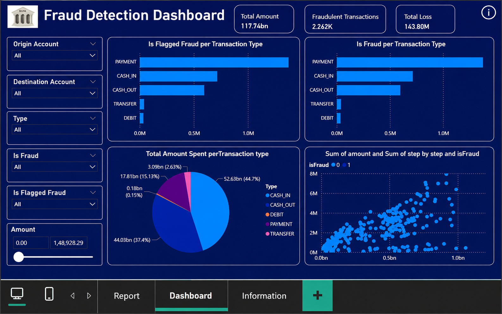
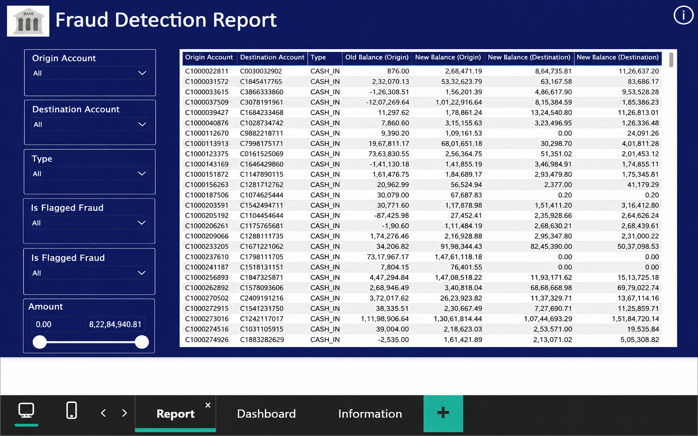

# Fraud Detection Using Ensemble Learning and MLP

This project focuses on detecting fraudulent financial transactions using machine learning and presenting the results through an interactive Power BI dashboard.

The workflow includes exploratory data analysis, data preprocessing, handling class imbalance, feature preparation, model training, model comparison, performance evaluation, and dashboard development. The project compares a Random Forest model with a Multi-Layer Perceptron (MLP) neural network for fraud detection.

## Project Overview

Financial fraud detection is challenging because fraudulent transactions are usually much less common than legitimate transactions. This project analyses transaction data to identify fraud patterns and build models that can distinguish fraudulent transactions from normal activity.

The dataset contains more than 6 million transaction records with information such as transaction type, transaction amount, source and destination balances, and fraud labels. For modelling, a subset of 3 million records was used to improve computational efficiency.

## Project Workflow

The project followed an end-to-end analytics and machine learning workflow:

* Exploratory Data Analysis
* Missing value and duplicate checks
* Outlier analysis
* Correlation analysis
* Transaction type analysis
* Feature selection
* Categorical encoding
* Feature scaling
* Handling class imbalance using SMOTE
* Train-test splitting
* Random Forest model development
* Multi-Layer Perceptron model development
* Model evaluation and comparison
* Power BI dashboard development

## Exploratory Data Analysis

Exploratory analysis was carried out to understand transaction behaviour and identify patterns associated with fraudulent activity.

The analysis included:

* Checking missing and duplicate values
* Analysing fraud class imbalance
* Identifying outliers in numerical features
* Studying correlations between transaction variables
* Analysing transaction types
* Exploring transaction amounts and temporal patterns
* Comparing fraudulent and non-fraudulent activity

The analysis showed that fraudulent transactions represented a very small proportion of the overall dataset, making class imbalance an important consideration during model development.

## Data Preprocessing

The dataset was prepared for modelling through several preprocessing steps.

Key steps included:

* Removing redundant or low-value features
* One-hot encoding transaction types
* Encoding account identifiers
* Handling outliers using the IQR method
* Applying SMOTE to address class imbalance
* Standardising numerical features
* Splitting the dataset into training and testing sets

## Machine Learning Models

Two models were developed and compared.

### Random Forest

The Random Forest classifier was used as an ensemble learning approach for fraud detection.

It achieved:

* **Accuracy:** approximately 93.39%
* **Precision:** approximately 97.82%
* **Recall:** approximately 88.75%
* **F1 Score:** approximately 93.06%
* **ROC AUC:** approximately 0.987

### Multi-Layer Perceptron

A Multi-Layer Perceptron neural network was developed using TensorFlow/Keras.

It achieved:

* **Accuracy:** approximately 92.87%
* **Precision:** approximately 97.41%
* **Recall:** approximately 88.09%
* **F1 Score:** approximately 92.51%
* **ROC AUC:** approximately 0.983

Overall, the Random Forest model slightly outperformed the MLP model across the main evaluation metrics.

## Power BI Dashboard

An interactive Power BI dashboard was developed to present the analysis and make fraud patterns easier to understand and explore.

The dashboard includes:

* Total transaction amount
* Number of fraudulent transactions
* Estimated financial loss
* Fraud distribution by transaction type
* Transaction amount analysis
* Fraud patterns across transaction activity
* Interactive filters for transaction type
* Account-level filtering
* Fraud-status filtering
* Transaction amount filtering

The dashboard also includes a detailed transaction-level reporting page that allows users to inspect individual transactions and perform manual analysis.

### Full Power BI Dashboard File

The complete interactive Power BI dashboard is available through Google Drive:

[**View / Download Power BI Dashboard (.pbix)**](https://drive.google.com/file/d/1d9U1df5v8pXvah2ajRezyoIl1r3zfzxI/view?usp=sharing)

> **Note:** Microsoft Power BI Desktop is required to open and interact with the `.pbix` file.

## Dashboard Preview



## Detailed Transaction Report



## Repository Structure

```text
Fraud-detection-using-ensemble-learning-and-MLP/
│
├── README.md
├── Fraud_detection_using_ensemble_learning_and_MLP.ipynb
├── images/
│   ├── fraud_dashboard.png
│   └── fraud_report.png
└── requirements.txt
```

## Technologies Used

* Python
* Power BI
* Pandas
* NumPy
* Scikit-learn
* TensorFlow/Keras
* Random Forest
* Multi-Layer Perceptron
* SMOTE
* Matplotlib
* Seaborn

## Key Result

The Random Forest model achieved the strongest overall performance with an **F1 score of approximately 93.06%**, slightly outperforming the Multi-Layer Perceptron model while maintaining strong precision and recall.

The Power BI dashboard complements the machine learning analysis by presenting fraud trends, transaction activity, estimated financial loss, and transaction-level insights through clear and interactive visualisations.
